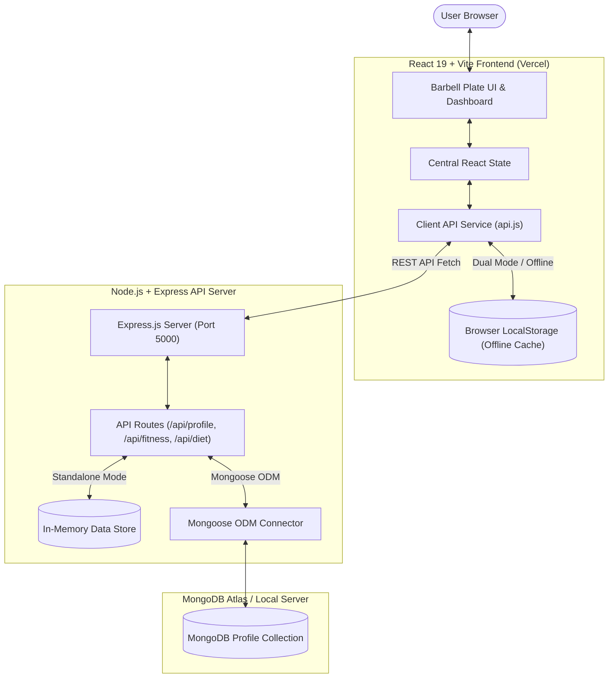

# 🏋️‍♂️ FORGE — Train. Track. Transform.

[](https://forge-vht8.vercel.app/)
[](https://github.com/Arun-1107/FORGE)
[](https://react.dev/)
[](https://vitejs.dev/)
[](https://nodejs.org/)
[](https://www.mongodb.com/)
[](https://opensource.org/licenses/MIT)

> **"Strength is forged in the fires of discipline."**  
> *Every rep. Every gram. One unified log.*

---

## ⚡ Live Application & Repository Links

* 🌐 **Live Web Application (Vercel):** [https://forge-vht8.vercel.app/](https://forge-vht8.vercel.app/)
* 📦 **GitHub Source Code:** [https://github.com/Arun-1107/FORGE](https://github.com/Arun-1107/FORGE)

---

## 📖 Table of Contents

- [Project Overview](#-project-overview)
- [Key Features & The 7 Barbell Plates](#-key-features--the-7-barbell-plates)
- [System Architecture](#-system-architecture)
- [Tech Stack](#-tech-stack)
- [Dual-Mode Operation](#-dual-mode-operation)
- [Project Folder Structure](#-project-folder-structure)
- [Installation & Getting Started](#-installation--getting-started)
- [Available NPM Scripts](#-available-npm-scripts)
- [API Endpoints Reference](#-api-endpoints-reference)
- [Deployment Guide](#-deployment-guide)
- [License & Acknowledgements](#-license--acknowledgements)

---

## 🌟 Project Overview

**FORGE** is an advanced, high-performance fitness management platform built on the **MERN (MongoDB, Express, React, Node.js)** stack. 

Unlike traditional generic fitness trackers, FORGE models training and nutrition around an **interactive Olympic barbell** visual paradigm. The barbell rack consists of **7 loaded plates**, each dedicated to an essential pillar of body transformation: biometrics, training volume, adaptive splits, caloric partitioning, tailored supplementation, and health longevity.

Whether you are stepping into a gym for the first time or calibrating macronutrients for competitive bodybuilding, FORGE dynamically adjusts training protocols, caloric targets, and recovery guidance to your specific biological metrics.

---

## 🎯 Key Features & The 7 Barbell Plates

```
       [ BARBELL RACK - 7 INTERACTIVE PLATES ]
┌───────┬───────┬───────┬───────┬───────┬───────┬────────┐
│  01   │  02   │  03   │  04   │  05   │  06   │   07   │
│Profile│ Level │ Train │Strateg│ Fuel  │ Stacks│ Adult* │
└───────┴───────┴───────┴───────┴───────┴───────┴────────┘
```

### 1. 🪪 Plate 01: Profile & Biometrics
- **Comprehensive Body Metrics:** Tracks Name, Age, Height (cm), Weight (kg), and Body Fat %.
- **Automated Caloric Formulas:** Calculates **BMI**, **BMR** (Basal Metabolic Rate), and **TDEE** (Total Daily Energy Expenditure).
- **Progress Photo Upload:** Directly upload and cache transformation photos in your browser profile.
- **Fast Sign-Out / Session Reset:** One-click session clearing for privacy on shared devices.

### 2. 📈 Plate 02: Adaptive Fitness Level
- **3 Dynamic Tiers:** `Beginner`, `Intermediate`, and `Advanced`.
- **Intelligent Routing:** Changing your experience level instantly cascades into customized workout splits, recovery windows, and macronutrient ratios.

### 3. 🏋️‍♂️ Plate 03: Training & Workout Engine
- **Custom Split Selector:** Push / Pull / Legs (PPL), Upper / Lower, Full Body, and Bro Split.
- **Exercise Breakdown:** Target sets, rep ranges, target muscle groups, and movement mechanics.
- **Interactive Set Checklist:** Check off sets in real-time as you complete them in the gym.
- **Built-in Rest Interval Timer:** Keep workout density high with immediate rest countdowns between working sets.

### 4. 🎯 Plate 04: Strategy & Diet Goals
- **Tailored Caloric Profiles:**
  - `Fat Loss` (Moderate deficit for steady fat burning)
  - `Aggressive Cut` (Strict deficit for rapid cutting)
  - `Maintenance` (Body recomposition and weight stability)
  - `Lean Bulk` (Slight surplus to maximize muscle hypertrophy while minimizing fat)
  - `Aggressive Bulk` (Heavy surplus for strength and mass phases)

### 5. 🥗 Plate 05: Fuel & Macronutrient Engine
- **Exact Calorie Target:** Real-time formula balancing TDEE against selected diet strategy.
- **Macronutrient Gram Splits:**
  - **Protein:** Targeted gram goals for optimal muscle protein synthesis (MPS).
  - **Carbohydrates:** Optimized for workout performance and glycogen replenishment.
  - **Healthy Fats:** Dialed in for hormonal health and joint longevity.
- **Hydration Tracker:** Personalized daily water intake goals based on body weight.
- **Meal Timing Schedule:** Pre-workout, post-workout, and peri-workout nutrient timing strategies.

### 6. 💊 Plate 06: Supplement Stacks
- **Goal-Oriented Stacks:** Science-backed recommendations filtered by your fitness level and goals.
- **Core Essentials:** Whey Protein, Micronized Creatine Monohydrate, Electrolytes, Omega-3s, Multivitamins, and Performance Pre-workouts.
- **Safety & Dosage Guide:** Clear instructions on when and how to take each supplement for maximum bio-availability.

### 7. 🔒 Plate 07: Adult Zone (18+ Age Gated)
- **Age-Verification Gate:** Automatic ID unlock when profile age $\ge$ 18.
- **Educational & Harm-Reduction Information:** Advanced topics covering hormonal balance, endocrine health, sleep architecture, stress cortisol management, and safe athletic longevity protocols.

---

## 🏗️ System Architecture



---

## 💻 Tech Stack

| Layer | Technologies & Tools |
|---|---|
| **Frontend** | React 19, Vite 8, Modern CSS Variables, Oswald & Inter Web Fonts |
| **Backend** | Node.js, Express.js 4, Dotenv, CORS |
| **Database** | MongoDB, Mongoose 8 (with graceful In-Memory fallback) |
| **Tooling & Orchestration** | Concurrently, Oxlint, PowerShell automation, Start.bat |
| **Hosting & CI/CD** | **Vercel** (Frontend SPA), **GitHub** (Version Control) |

---

## 🔄 Dual-Mode Operation

FORGE was engineered to be **resilient and zero-config**:

1. **Mode A: Frontend-Only (Client Mode — Default on Vercel)**
   - Requires zero database setup.
   - Runs seamlessly in any modern browser.
   - Persists user metrics, logs, splits, and verified status via encrypted `localStorage`.
   - **Try it now on Vercel:** [https://forge-vht8.vercel.app/](https://forge-vht8.vercel.app/)

2. **Mode B: Full-Stack MERN Mode (Client + Server + MongoDB)**
   - Connects React frontend directly to Express API (`http://localhost:5000/api`).
   - Automatically synchronizes profile data to MongoDB.
   - Includes graceful in-memory storage fallback if MongoDB is momentarily unreachable.

---

## 📂 Project Folder Structure

```text
FORGE/
├── .gitignore               # Root Git ignore rules
├── package.json             # Root workspace scripts & concurrency runner
├── package-lock.json        # Root lockfile
├── README.md                # Project documentation with live demo & guide
├── fit.html                 # Original prototype & design mockup
├── start.bat                # 1-click Windows runner (starts client + server)
│
├── client/                  # Frontend Application (Vite + React 19)
│   ├── index.html           # HTML entry point with typography
│   ├── vite.config.js       # Vite build & dev-server configuration
│   ├── package.json         # Client dependencies & scripts
│   ├── src/
│   │   ├── main.jsx         # React application mount
│   │   ├── App.jsx          # Root application, barbell state & routing
│   │   ├── index.css        # Theme, layout, and animated barbell styling
│   │   ├── api.js           # Smart API connector (REST / LocalStorage)
│   │   ├── assets/          # Static logos, hero assets, SVG icons
│   │   └── modules/         # Modular components for the 7 plates
│   │       ├── Profile.jsx       # Plate 01: Profile & Biometrics
│   │       ├── FitnessLevel.jsx  # Plate 02: Level Selection
│   │       ├── Workouts.jsx      # Plate 03: Exercise & Set Tracker
│   │       ├── Nutrition.jsx     # Plate 05: Macronutrients & Calories
│   │       ├── Supplements.jsx   # Plate 06: Curated Supplement Stacks
│   │       ├── DietGoal.jsx      # Plate 04: Caloric Strategy Goals
│   │       └── AdultZone.jsx     # Plate 07: 18+ Age Gated Section
│
└── server/                  # Backend Application (Express & Node.js)
    ├── server.js            # Express server entry point & middleware
    ├── .env                 # Environment secrets (PORT, MONGO_URI)
    ├── package.json         # Server dependencies & scripts
    ├── config/
    │   └── db.js            # Mongoose MongoDB connection handler
    ├── models/
    │   └── Profile.js       # Mongoose Schema for user profiles
    └── routes/
        └── api.js           # REST API endpoints (/api/profile, etc.)
```

---

## 🚀 Installation & Getting Started

### Prerequisites
- [Node.js](https://nodejs.org/) (v18.0 or newer recommended)
- [Git](https://git-scm.com/)
- *(Optional for Full-Stack mode)* [MongoDB Community Server](https://www.mongodb.com/try/download/community) or [MongoDB Atlas URI](https://cloud.mongodb.com)

---

### Step 1: Clone the Repository

```bash
git clone https://github.com/Arun-1107/FORGE.git
cd FORGE
```

---

### Step 2: Install All Dependencies

Install dependencies across root, client, and server in one command:

```bash
npm run install-all
```

Or install manually:
```bash
npm install
cd client && npm install
cd ../server && npm install
cd ..
```

---

### Step 3: Configure Environment Variables (Optional for Backend)

Inside `server/.env`:

```env
PORT=5000
MONGO_URI=mongodb://127.0.0.1:27017/forge_db
```

---

### Step 4: Run the Application

#### Option 1: Quick Windows Launcher
Simply double-click `start.bat` in the project root! It will launch both client and backend servers and open `http://localhost:5173` automatically in your browser.

#### Option 2: Full MERN Stack (Concurrently)
```bash
npm run dev
```

#### Option 3: Frontend-Only Development
```bash
npm run client
```

#### Option 4: Backend-Only Development
```bash
npm run server-dev
```

Open your browser at **`http://localhost:5173`** to access the platform.

---

## 📜 Available NPM Scripts

| Command | Action |
|---|---|
| `npm run dev` | Runs both React client (`:5173`) and Express backend (`:5000`) simultaneously |
| `npm run client` | Starts Vite React client development server |
| `npm run server` | Starts Express backend production node process |
| `npm run server-dev` | Starts Express backend with `nodemon` auto-reload |
| `npm run install-all` | Installs all dependencies for both `client/` and `server/` |

---

## 📡 API Endpoints Reference

The backend Express server exposes standard RESTful endpoints under `/api`:

| Method | Endpoint | Description | Payload Example |
|---|---|---|---|
| `GET` | `/api/profile` | Retrieve active user profile & metrics | — |
| `POST` | `/api/profile` | Update or create user biometrics | `{"name": "Arun", "age": 24, "height": 178, "weight": 75, "bodyfat": 14}` |
| `GET` | `/api/fitness` | Fetch current fitness level | — |
| `POST` | `/api/fitness` | Update fitness level | `{"level": "intermediate"}` |
| `GET` | `/api/diet` | Fetch current dietary goal | — |
| `POST` | `/api/diet` | Update dietary goal | `{"goal": "lean-bulk"}` |

---

## 🌐 Deployment Guide

### Deploying Frontend to Vercel (Current Live Setup)

The frontend is live at **[https://forge-vht8.vercel.app/](https://forge-vht8.vercel.app/)**.

To deploy your own instance to Vercel:
1. Push your repository to GitHub.
2. Log in to [Vercel](https://vercel.com/) and click **"New Project"**.
3. Import your `FORGE` repository.
4. Set the **Root Directory** to `client`.
5. Select **Vite** as the Framework Preset.
6. Click **Deploy**. Vercel will build and deploy the React application in seconds!

---

## 🤝 Contributing

Contributions, feedback, and feature suggestions are welcome!

1. Fork the Project (`https://github.com/Arun-1107/FORGE/fork`)
2. Create your Feature Branch (`git checkout -b feature/AmazingFeature`)
3. Commit your Changes (`git commit -m 'Add some AmazingFeature'`)
4. Push to the Branch (`git push origin feature/AmazingFeature`)
5. Open a Pull Request

---

## 📄 License

Distributed under the **MIT License**. See `LICENSE` for more information.

---

<div align="center">
  <b>FORGE — Train. Track. Transform.</b><br>
  Built with ❤️ by <a href="https://github.com/Arun-1107">Arun-1107</a><br>
  <a href="https://forge-vht8.vercel.app/">⚡ Experience Live Demo</a>
</div>
